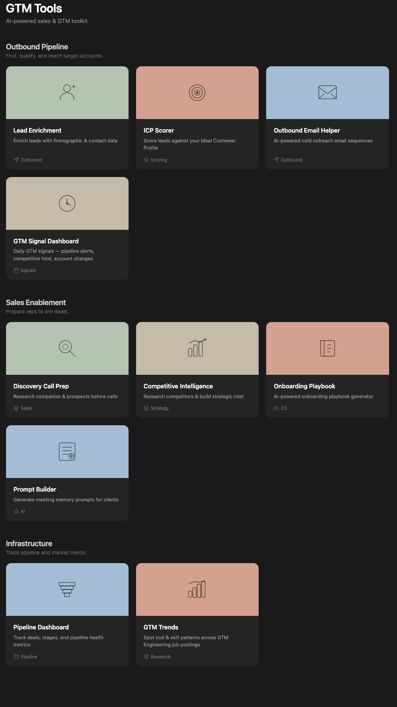
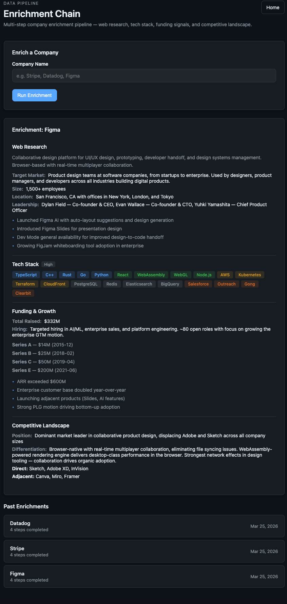
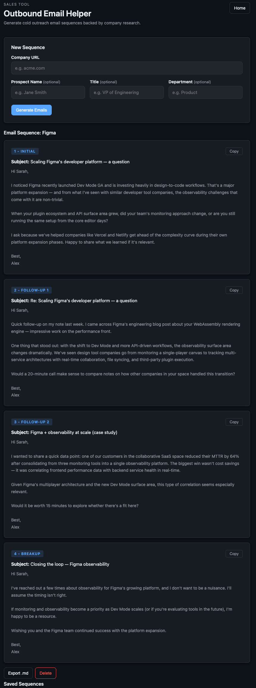
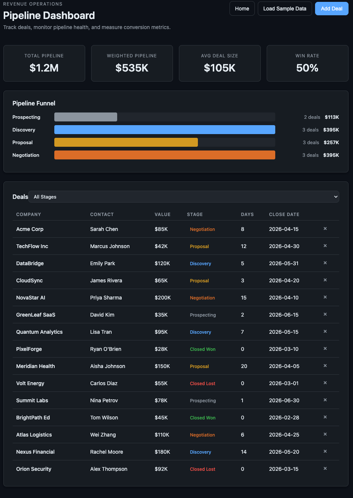

# gtm-tools

A local-first toolkit of 11 small web apps covering the GTM lifecycle — outbound, sales enablement, pipeline, retention. Built with Python, Flask, and Claude Code as core development infrastructure.

## Why this exists

Most GTM software hides how the work actually happens. Prospecting, qualification, call prep, battlecards, outbound, pipeline hygiene — all locked inside SaaS tools with opaque logic and vendor lock-in.

Every app in gtm-tools is one Python file plus templates. You can read it, fork it, change the prompt, swap the data model. Nothing runs in the cloud. No API keys to manage.

I built it while pivoting from CSM into the more technical side of GTM. Each app is a working answer to an operator question I had while doing the job.

## Quick start

```bash
git clone https://github.com/dan-sheehan/gtm-tools.git
cd gtm-tools
make install
make start
make seed     # loads sample data so you can click around without Claude CLI
# open http://localhost:8000
```

Runs on Python 3.11+. The AI-powered tools (discovery, competitive intel, outbound email, prompt builder, playbook) need the [Claude CLI](https://docs.anthropic.com/en/docs/claude-code) installed and a Claude Max subscription. Everything else runs on a fresh Python install.

## What's inside

**Outbound pipeline**
- Lead Enrichment — multi-step company research
- ICP Scorer — rule-based fit scoring
- Outbound Email — persona-targeted 4-touch cadences
- Signal Dashboard — daily pipeline, competitive, and account signals

**Sales enablement**
- Discovery Call Prep — company and prospect research
- Competitive Intel — battlecards and positioning
- Onboarding Playbook — segment-specific onboarding plans
- Prompt Builder — customer enablement tool I built at Rumi to teach users how to write effective prompts for searching their meeting history

**Infrastructure**
- Pipeline Dashboard — deal tracking with weighted metrics
- GTM Trends — analyze job postings for tool and skill patterns
- Gateway — reverse proxy at localhost:8000

## Screenshots

| | |
|---|---|
|  |  |
|  |  |

## How it works

- **Gateway pattern** — one entry point at `localhost:8000` routes by path prefix to independent Flask backends. Each app can also run standalone on its own port.
- **AI layer** — Claude CLI via subprocess, streamed to the browser over Server-Sent Events. Tools that need web research pass `--allowedTools WebSearch,WebFetch`.
- **Storage** — SQLite per app at `~/.appname/appname.db`. No shared state, easy to reset.
- **Frontend** — vanilla HTML, CSS, JS. No build step, no node_modules.
- **Local-first** — data stays on your machine. No telemetry, no external databases.

## Status

This is a personal project I keep building on, not a production library. No SLAs, no release cadence. If you fork it and break something, the fix is one file away.

## Built with

Claude Code is core tooling for this repo — for design, implementation, refactors, and tests. Each app is small enough to hold in one prompt, which made the iteration loop unusually fast.

## License

MIT. See [LICENSE](LICENSE).

